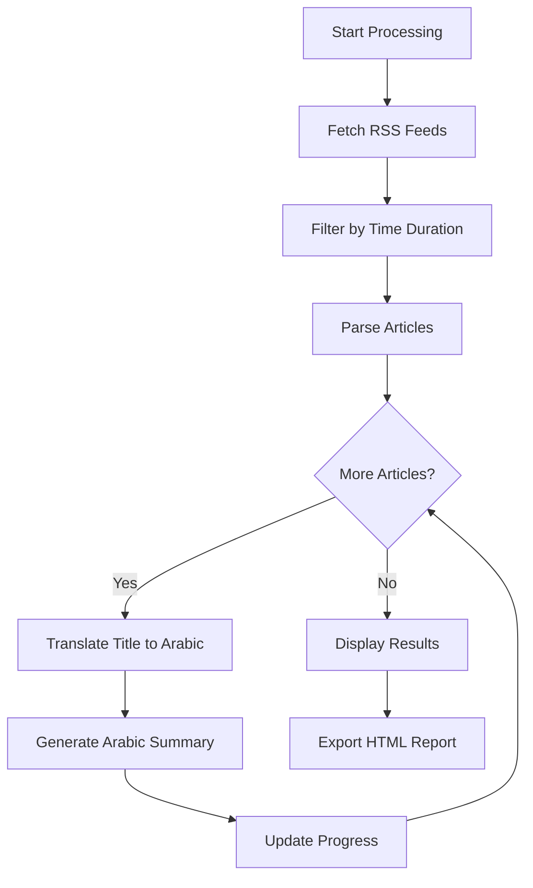
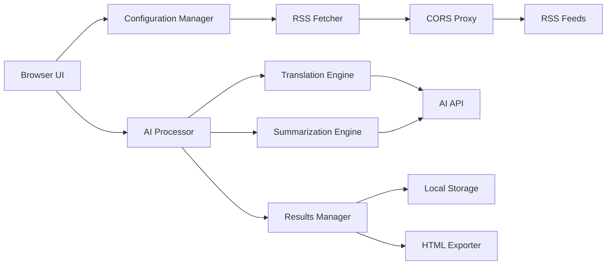

# xsukax RSS Feeds Arabic AI Summarizer

    

A sophisticated, client-side RSS feed aggregator and AI-powered summarization tool that translates news articles into Arabic and generates comprehensive summaries using advanced language models. Built with privacy and security as core principles, this application runs entirely in your browser without requiring any backend infrastructure.

https://xsukax-rss-feeds-arabic-ai-summarizer.pages.dev/

## 🎯 Project Overview

**xsukax RSS Feeds Arabic AI Summarizer** is a powerful web application designed to help Arabic-speaking users stay informed about global news. The application aggregates RSS feeds from multiple sources, intelligently filters recent articles, translates titles to Arabic, and generates detailed, high-quality summaries in Modern Standard Arabic (MSA) using AI language models.

### Primary Functionalities

- **Multi-Source RSS Aggregation**: Fetch and consolidate news from unlimited RSS feed sources
- **Intelligent Time Filtering**: Automatically filter articles based on customizable time windows (1-168 hours)
- **AI-Powered Translation**: Translate article titles from any language to professional Arabic
- **Comprehensive Summarization**: Generate detailed, two-paragraph Arabic summaries with proper context and analysis
- **Export Capabilities**: Save configurations and generate beautiful HTML reports
- **Real-Time Progress Tracking**: Monitor processing status with live statistics and logging
- **Persistent Configuration**: Store settings locally in browser for seamless user experience

## 🔒 Security and Privacy Benefits

This application prioritizes user security and privacy through multiple architectural and design decisions:

### Client-Side Architecture
The entire application runs exclusively in the browser using vanilla JavaScript with no backend server requirements. This means your data never passes through any intermediary servers, reducing attack surfaces and privacy concerns significantly.

### User-Controlled API Keys
You maintain complete control over your AI API credentials. The API key is stored locally in your browser's localStorage and is never transmitted to any server except directly to your chosen AI service endpoint. This ensures that only you have access to your API credentials.

### No Data Collection or Tracking
The application contains zero analytics, tracking pixels, or telemetry. No usage data, article content, or personal information is collected, transmitted, or stored on external servers. Your reading habits and interests remain completely private.

### Transparent Open Source
All source code is publicly available for security auditing and transparency. Users can inspect every line of code to verify there are no hidden backdoors, data exfiltration mechanisms, or malicious functionality.

### Local Storage Only
Configuration data and processing results are stored exclusively in your browser's localStorage. You can clear this data at any time, and it never leaves your device unless you explicitly export it.

### HTTPS-Compatible
The application is designed to work seamlessly over HTTPS, ensuring encrypted communication with AI APIs and RSS feed sources when deployed on secure hosting platforms.

### Configurable CORS Proxy
Users can specify their own CORS proxy service, allowing for additional privacy layers or self-hosted proxy solutions rather than being forced to use a specific third-party service.

## ✨ Features and Advantages

### Unique Selling Points

1. **Zero Infrastructure Requirements**: No servers to maintain, no databases to manage, no deployment complexity. Simply open the HTML file in any modern browser.

2. **AI Model Flexibility**: Compatible with any OpenAI-compatible API, including GPT-4, Claude, local models, or custom endpoints. Not locked into a single AI provider.

3. **Professional Arabic Output**: Generates summaries in Modern Standard Arabic (MSA) with proper grammar, structure, and journalistic style. Each summary consists of two comprehensive paragraphs with 4-5 detailed sentences each.

4. **Beautiful, Modern UI**: GitHub-inspired dark theme with smooth animations, responsive design, and excellent user experience across devices.

5. **Batch Processing Intelligence**: Processes multiple articles sequentially with rate limiting, error handling, and the ability to stop/resume operations.

6. **Comprehensive Export Options**: Generate professional HTML reports with embedded styling, perfect for sharing or archiving news summaries.

7. **Configuration Management**: Import/export configuration files for easy setup across devices or sharing settings with colleagues.

8. **Real-Time Statistics**: Live tracking of processing progress, success rates, and error logging for complete visibility.

9. **Multilingual Source Support**: Process RSS feeds in any language, automatically translating titles and generating Arabic summaries.

10. **No Installation Required**: Pure HTML/CSS/JavaScript application that works immediately without npm, build steps, or dependencies.

## 📥 Installation Instructions

### Method 1: Direct Download

1. Download the `index.html` file from this repository:
   ```bash
   wget https://raw.githubusercontent.com/xsukax/xsukax-RSS-Feeds-Arabic-AI-Summarizer/main/index.html
   ```

2. Open the file in any modern web browser:
   - **Chrome/Edge**: Double-click the file or drag it into the browser
   - **Firefox**: Double-click or use File → Open File
   - **Safari**: Double-click or drag to browser window

### Method 2: Git Clone

1. Clone the repository:
   ```bash
   git clone https://github.com/xsukax/xsukax-RSS-Feeds-Arabic-AI-Summarizer.git
   ```

2. Navigate to the directory:
   ```bash
   cd xsukax-RSS-Feeds-Arabic-AI-Summarizer
   ```

3. Open `index.html` in your browser:
   ```bash
   # On Linux
   xdg-open index.html
   
   # On macOS
   open index.html
   
   # On Windows
   start index.html
   ```

### Method 3: Web Hosting (Recommended for Production)

Deploy to any static hosting platform:

- **GitHub Pages**: Push to a repository and enable Pages in settings
- **Netlify**: Drag and drop the HTML file to Netlify dashboard
- **Vercel**: Import the repository and deploy
- **Cloudflare Pages**: Connect repository or upload file

### System Requirements

- Modern web browser (Chrome 90+, Firefox 88+, Safari 14+, Edge 90+)
- JavaScript enabled
- Internet connection for RSS feeds and AI API calls
- Valid AI API key (OpenAI, Anthropic, or compatible service)

## 📖 Usage Guide

### Initial Setup

1. **Configure AI API Settings**
   - Enter your AI API URL (e.g., `https://api.openai.com/v1/chat/completions`)
   - Input your AI API key
   - Select your preferred model (e.g., `gpt-4`, `claude-sonnet-4-5`)

2. **Set News Duration**
   - Specify time window in hours (1-168)
   - Only articles published within this timeframe will be processed

3. **Add RSS Feeds**
   - Enter RSS feed URLs, one per line
   - Supports RSS 2.0 and Atom formats
   - Examples:
     ```
     https://rss.nytimes.com/services/xml/rss/nyt/HomePage.xml
     https://feeds.bbci.co.uk/news/rss.xml
     https://www.aljazeera.com/xml/rss/all.xml
     ```

4. **Save Configuration**
   - Click "💾 Save Config" to store settings in browser
   - Use "📥 Export Config" to save configuration file
   - Use "📂 Load Config" to import saved settings

### Processing Workflow



### Step-by-Step Processing

1. **Click "▶️ Start Processing"**
   - Application fetches all configured RSS feeds
   - Articles are filtered based on publication date
   - Processing begins automatically

2. **Monitor Progress**
   - Watch real-time statistics update
   - View processing log for detailed information
   - Track success/failure rates

3. **Review Results**
   - Processed articles appear in the results panel
   - Each article shows:
     - Original title (with link to source)
     - Arabic translation
     - Comprehensive Arabic summary
     - Publication date and source

4. **Export Report**
   - Click "📤 Export HTML" to generate standalone report
   - Report includes all summaries in professional format
   - Perfect for sharing or archiving

### Application Architecture



### Advanced Features

#### Configuration Management
- **Browser Storage**: Automatically saves configuration to localStorage
- **Export/Import**: Transfer settings between devices using JSON files
- **Multiple Profiles**: Manually save different configuration files for various use cases

#### Error Handling
- Automatic retry logic with exponential backoff
- Detailed error logging in processing log
- Failed articles marked clearly with error messages
- Processing can be stopped and resumed at any time

#### Customization Options
- Adjust AI model parameters (temperature, max tokens)
- Configure CORS proxy for different services
- Customize time filtering for news freshness
- Support for any OpenAI-compatible API endpoint

### Common Workflows

#### Daily News Digest
1. Set duration to 24 hours
2. Configure preferred RSS feeds
3. Run processing once daily
4. Export HTML report for reading offline

#### Research & Analysis
1. Set longer duration (48-72 hours)
2. Add specialized RSS feeds for specific topics
3. Process articles for comprehensive coverage
4. Use summaries for research purposes

#### Multi-Language News Monitoring
1. Add RSS feeds from various countries
2. Application automatically translates all to Arabic
3. Generate unified summaries across languages
4. Export consolidated report

## 📄 License

This project is licensed under the GNU General Public License v3.0.

---

**Made with ❤️ for the Arabic-speaking community • Powered by AI • Privacy-First Design**
